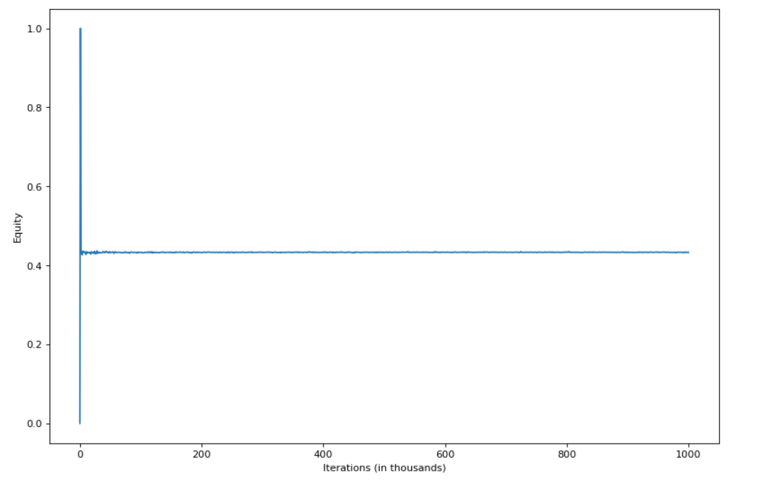
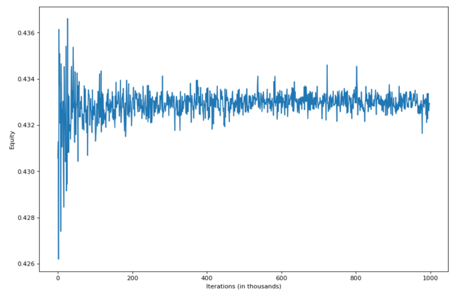
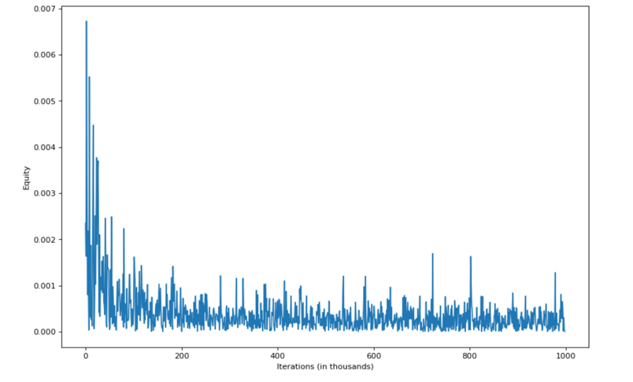

# Poker Equity Calculator
Calculate equity for every card in my range vs arbitrary amount of opponents ranges with weights

## Dev
Repository in development, now available only equity on river, planned to add flop and turn

## Algorithm
1. Select hand from my range
2. Choose hands for each of opponent with pseudo random generator using weights
3. If not river, sample cards on boards to reach amount of 5
4. Count +1 to wins count for selected hand if it is one of winners
5. Write equity as <wins count> / <iterations count>

## CLI
`go-poker-equity [--iter N] [--timeout t] <board> <my range> <opp 1 ranges 1> <opp2 range> <opp n range>...`

Optional flags in square brackets
1. `--iter n` - Max iterations count (int number grater or equal zero). Default 0. If 0, stops by timeout
2. `--timeout t` - Timeout in seconds (can be both float or integer value)
3. `<board>` - Board in format: cards without spaces, for example `6s9c4hQcKd`
4. `<my range>` - Range to measure equity for each hand (weights ignored), in format `<hand>,<hand>...` or `<hand>:<weight>,...`, 
5. `<hand>` - Hand in format `<value>` (upper case: `23456789TJQKA`) with `<suit>` (lower case: `schd`), example: `9s9c`, `AcJh`
6. `<opp k range>` - Range for k-th opponent with weights in format `<hand>,<hand>...` or `<hand>:<weight>,...`,
if weight omitted, it stands as 1. 
8`<weight>` - number from 0 to 1, for example `0.34`, `0.002`

## Build
```
go build .
```

## Usage Examples
```
./go-poker-equity --iter 1 6s9c4hQcKd KsKc 2s3h
{"equity":{"KsKc":1},"time_delta":0,"iterations":1}
```
```
./go-poker-equity --iter 1000 6s9c4hQcKd 6c8d KsKh:0.3,2h3s
{"equity":{"6c8d":0.767},"time_delta":0.001,"iterations":1000
```
```
./go-poker-equity . --timeout 0.1 6s9c4hQcKd 6c8d KsKh:0.3,2h3s
{"equity":{"6c8d":0.7677752},"time_delta":0.1,"iterations":123501}
```
```
./go-poker-equity --iter 10000 7hAsQdJs8h 9d9c:0.209,9h9c:0.212,9h9d:0.201,9s9c:0.209,9s9d:0.186,9s9h:0.201,AcJc:0.095,AcJd:0.095,AcJh:0.095,AcKc:0.044,AcKd:0.044,AcKh:0.056,AcKs:0.045,AcQc:0.045,AcQh:0.035,AcQs:0.046,AcTc:0.076,AcTd:0.077,AcTh:0.091,AcTs:0.077,AdAc:0.009,AdJc:0.095,AdJd:0.095,AdJh:0.095,AdKc:0.045,AdKd:0.045,AdKh:0.056,AdKs:0.045,AdQc:0.045,AdQh:0.035,AdQs:0.046,AdTc:0.076,AdTd:0.077,AdTh:0.091,AdTs:0.077,AhAc:0.015,AhAd:0.015,AhJc:0.1,AhJd:0.1,AhJh:0.2,AhKc:0.06,AhKd:0.06,AhKh:0.1,AhKs:0.06,AhQc:0.059,AhQh:0.097,AhQs:0.06,AhTc:0.104,AhTd:0.105,AhTh:0.1,AhTs:0.105,AsAc:0.009,AsAd:0.009,AsAh:0.015,AsJc:0.095,AsJd:0.095,AsJh:0.095,AsKc:0.045,AsKd:0.045,AsKh:0.056,AsKs:0.045,AsQc:0.045,AsQh:0.035,AsQs:0.046,AsTc:0.076,AsTd:0.077,AsTh:0.091,AsTs:0.077,JdJc:0.086,JhJc:0.068,JhJd:0.068,KcQc:0.04,KcQh:0.031,KcQs:0.04,KdKc:0.002,KdQc:0.04,KdQh:0.031,KdQs:0.04,KhKc:0.012,KhKd:0.012,KhQc:0.048,KhQh:0.08,KhQs:0.051,KsKc:0.002,KsKd:0.002,KsKh:0.012,KsQc:0.04,KsQh:0.031,KsQs:0.04,QhQc:0.065,Qs5c:0.274,QsQc:0.094,QsQh:0.063,TdTc:0.261,ThTc:0.301,ThTd:0.3,TsTc:0.261,TsTd:0.259,TsTh:0.301 3h2h:0.619,4h2h:0.693,4h3h:0.75,5h2h:0.883,5h3h:0.98,5h4h:1,6c5c:0.098,6c5d:0.203,6c5h:0.204,6c5s:0.206,6d5c:0.207,6d5d:0.102,6d5h:0.205,6d5s:0.207,6h2h:0.796,6h3h:0.869,6h4h:1,6h5c:0.396,6h5d:0.204,6h5s:0.207,6s5c:0.206,6s5d:0.203,6s5h:0.204,6s5s:0.103,7c2c:1,7c3c:0.792,7c4c:0.432,7c5c:0.487,7c6h:0.672,7d2d:1,7d3d:0.797,7d4d:0.435,7d5c:0.489,7d6h:0.674,7s2s:1,7s3s:0.802,7s4s:0.435,7s5c:0.491,7s6h:0.675,8c2c:0.8,8c3c:0.8,8c4c:0.444,8c5c:0.513,8c6c:0.003,8c6d:0.008,8c6h:0.659,8c6s:0.004,8c7c:0.113,8c7d:0.232,8c7s:0.234,8d2d:0.8,8d3d:0.8,8d4d:0.448,8d6c:0.015,8d6d:0.009,8d6h:0.666,8d6s:0.014,8d7c:0.224,8d7d:0.114,8d7s:0.231,8s2s:0.8,8s3s:0.8,8s4s:0.445,8s6c:0.008,8s6d:0.011,8s6h:0.661,8s6s:0.003,8s7c:0.218,8s7d:0.224,8s7s:0.113,9c5c:0.2,9c6c:0.316,9c6d:0.326,9c6h:0.342,9c6s:0.325,9c7c:0.35,9c7d:0.694,9c7s:0.696,9c8c:0.369,9c8d:0.363,9c8s:0.363,9d5d:0.411,9d6c:0.291,9d6d:0.299,9d6h:0.336,9d6s:0.299,9d7c:0.658,9d7d:0.337,9d7s:0.665,9d8c:0.365,9d8d:0.359,9d8s:0.358,9h2h:0.548,9h3h:0.598,9h4h:0.792,9h5h:0.8,9h6c:0.403,9h6d:0.405,9h6h:0.794,9h6s:0.405,9h7c:0.693,9h7d:0.699,9h7s:0.7,9h8c:0.383,9h8d:0.378,9h8s:0.375,9s5s:0.412,9s6c:0.291,9s6d:0.299,9s6h:0.336,9s6s:0.299,9s7c:0.661,9s7d:0.666,9s7s:0.338,9s8c:0.364,9s8d:0.358,9s8s:0.358,Ah2h:0.232,Ah3h:0.238,Ah4h:0.254,Ah5h:0.279,Ah6h:0.276,Ah7c:0.064,Ah7d:0.067,Ah7s:0.067,Ah8c:0.11,Ah8d:0.112,Ah8s:0.111,Jc2c:0.3,Jc3c:0.3,Jc3d:0.3,Jc3h:0.3,Jc3s:0.3,Jc4c:0.3,Jc4d:0.3,Jc4h:0.3,Jc4s:0.3,Jc5c:0.061,Jc5d:0.3,Jc5h:0.197,Jc5s:0.3,Jc6c:0.3,Jc6d:0.3,Jc6h:0.225,Jc6s:0.3,Jd2d:0.3,Jd3c:0.3,Jd3d:0.3,Jd3h:0.3,Jd3s:0.3,Jd4c:0.3,Jd4d:0.3,Jd4h:0.3,Jd4s:0.3,Jd5c:0.062,Jd5d:0.3,Jd5h:0.199,Jd5s:0.3,Jd6c:0.3,Jd6d:0.3,Jd6h:0.227,Jd6s:0.3,Jh3c:0.246,Jh3d:0.247,Jh3s:0.249,Jh4c:0.288,Jh4d:0.289,Jh4s:0.288,Jh5c:0.02,Jh5d:0.154,Jh5s:0.155,Jh6c:0.179,Jh6d:0.176,Jh6s:0.174,Kh4h:0.029,Kh5h:0.155,Kh6h:0.114,Qc2c:0.051,Qc2d:0.05,Qc2h:0.088,Qc2s:0.062,Qc3c:0.025,Qc3d:0.025,Qc3s:0.027,Qc4c:0.038,Qc4d:0.038,Qc4h:0.004,Qc4s:0.037,Qc5d:0.022,Qc5s:0.024,Qc6c:0.006,Qc6d:0.005,Qc6s:0.003,Qh2c:0.101,Qh2d:0.1,Qh2s:0.11,Qh3c:0.09,Qh3d:0.09,Qh3s:0.091,Qh4c:0.09,Qh4d:0.091,Qh4s:0.09,Qh5d:0.083,Qh5s:0.083,Qh6c:0.075,Qh6d:0.072,Qh6s:0.071,Qs2c:0.033,Qs2d:0.032,Qs2h:0.07,Qs2s:0.047,Qs3c:0.005,Qs3d:0.005,Qs3s:0.008,Qs4c:0.034,Qs4d:0.034,Qs4s:0.033,Qs5d:0.001,Qs5s:0.004,Qs6c:0.038,Qs6d:0.034,Qs6s:0.033,Tc7c:0.327,Tc7d:0.645,Tc7s:0.642,Tc8c:0.315,Tc8d:0.312,Tc8s:0.311,Td7c:0.64,Td7d:0.331,Td7s:0.645,Td8c:0.315,Td8d:0.311,Td8s:0.31,Th2h:0.619,Th3h:0.646,Th4h:0.737,Th5h:0.8,Th6h:0.8,Th7c:0.609,Th7d:0.611,Th7s:0.613,Th8c:0.348,Th8d:0.342,Th8s:0.343,Ts7c:0.638,Ts7d:0.647,Ts7s:0.33,Ts8c:0.315,Ts8d:0.311,Ts8s:0.31
./go-poker-equity --iter 10000 7hAsQdJs8h 3h2h:0.619,4h2h:0.693,4h3h:0.75,5h2h:0.883,5h3h:0.98,5h4h:1,6c5c:0.098,6c5d:0.203,6c5h:0.204,6c5s:0.206,6d5c:0.207,6d5d:0.102,6d5h:0.205,6d5s:0.207,6h2h:0.796,6h3h:0.869,6h4h:1,6h5c:0.396,6h5d:0.204,6h5s:0.207,6s5c:0.206,6s5d:0.203,6s5h:0.204,6s5s:0.103,7c2c:1,7c3c:0.792,7c4c:0.432,7c5c:0.487,7c6h:0.672,7d2d:1,7d3d:0.797,7d4d:0.435,7d5c:0.489,7d6h:0.674,7s2s:1,7s3s:0.802,7s4s:0.435,7s5c:0.491,7s6h:0.675,8c2c:0.8,8c3c:0.8,8c4c:0.444,8c5c:0.513,8c6c:0.003,8c6d:0.008,8c6h:0.659,8c6s:0.004,8c7c:0.113,8c7d:0.232,8c7s:0.234,8d2d:0.8,8d3d:0.8,8d4d:0.448,8d6c:0.015,8d6d:0.009,8d6h:0.666,8d6s:0.014,8d7c:0.224,8d7d:0.114,8d7s:0.231,8s2s:0.8,8s3s:0.8,8s4s:0.445,8s6c:0.008,8s6d:0.011,8s6h:0.661,8s6s:0.003,8s7c:0.218,8s7d:0.224,8s7s:0.113,9c5c:0.2,9c6c:0.316,9c6d:0.326,9c6h:0.342,9c6s:0.325,9c7c:0.35,9c7d:0.694,9c7s:0.696,9c8c:0.369,9c8d:0.363,9c8s:0.363,9d5d:0.411,9d6c:0.291,9d6d:0.299,9d6h:0.336,9d6s:0.299,9d7c:0.658,9d7d:0.337,9d7s:0.665,9d8c:0.365,9d8d:0.359,9d8s:0.358,9h2h:0.548,9h3h:0.598,9h4h:0.792,9h5h:0.8,9h6c:0.403,9h6d:0.405,9h6h:0.794,9h6s:0.405,9h7c:0.693,9h7d:0.699,9h7s:0.7,9h8c:0.383,9h8d:0.378,9h8s:0.375,9s5s:0.412,9s6c:0.291,9s6d:0.299,9s6h:0.336,9s6s:0.299,9s7c:0.661,9s7d:0.666,9s7s:0.338,9s8c:0.364,9s8d:0.358,9s8s:0.358,Ah2h:0.232,Ah3h:0.238,Ah4h:0.254,Ah5h:0.279,Ah6h:0.276,Ah7c:0.064,Ah7d:0.067,Ah7s:0.067,Ah8c:0.11,Ah8d:0.112,Ah8s:0.111,Jc2c:0.3,Jc3c:0.3,Jc3d:0.3,Jc3h:0.3,Jc3s:0.3,Jc4c:0.3,Jc4d:0.3,Jc4h:0.3,Jc4s:0.3,Jc5c:0.061,Jc5d:0.3,Jc5h:0.197,Jc5s:0.3,Jc6c:0.3,Jc6d:0.3,Jc6h:0.225,Jc6s:0.3,Jd2d:0.3,Jd3c:0.3,Jd3d:0.3,Jd3h:0.3,Jd3s:0.3,Jd4c:0.3,Jd4d:0.3,Jd4h:0.3,Jd4s:0.3,Jd5c:0.062,Jd5d:0.3,Jd5h:0.199,Jd5s:0.3,Jd6c:0.3,Jd6d:0.3,Jd6h:0.227,Jd6s:0.3,Jh3c:0.246,Jh3d:0.247,Jh3s:0.249,Jh4c:0.288,Jh4d:0.289,Jh4s:0.288,Jh5c:0.02,Jh5d:0.154,Jh5s:0.155,Jh6c:0.179,Jh6d:0.176,Jh6s:0.174,Kh4h:0.029,Kh5h:0.155,Kh6h:0.114,Qc2c:0.051,Qc2d:0.05,Qc2h:0.088,Qc2s:0.062,Qc3c:0.025,Qc3d:0.025,Qc3s:0.027,Qc4c:0.038,Qc4d:0.038,Qc4h:0.004,Qc4s:0.037,Qc5d:0.022,Qc5s:0.024,Qc6c:0.006,Qc6d:0.005,Qc6s:0.003,Qh2c:0.101,Qh2d:0.1,Qh2s:0.11,Qh3c:0.09,Qh3d:0.09,Qh3s:0.091,Qh4c:0.09,Qh4d:0.091,Qh4s:0.09,Qh5d:0.083,Qh5s:0.083,Qh6c:0.075,Qh6d:0.072,Qh6s:0.071,Qs2c:0.033,Qs2d:0.032,Qs2h:0.07,Qs2s:0.047,Qs3c:0.005,Qs3d:0.005,Qs3s:0.008,Qs4c:0.034,Qs4d:0.034,Qs4s:0.033,Qs5d:0.001,Qs5s:0.004,Qs6c:0.038,Qs6d:0.034,Qs6s:0.033,Tc7c:0.327,Tc7d:0.645,Tc7s:0.642,Tc8c:0.315,Tc8d:0.312,Tc8s:0.311,Td7c:0.64,Td7d:0.331,Td7s:0.645,Td8c:0.315,Td8d:0.311,Td8s:0.31,Th2h:0.619,Th3h:0.646,Th4h:0.737,Th5h:0.8,Th6h:0.8,Th7c:0.609,Th7d:0.611,Th7s:0.613,Th8c:0.348,Th8d:0.342,Th8s:0.343,Ts7c:0.638,Ts7d:0.647,Ts7s:0.33,Ts8c:0.315,Ts8d:0.311,Ts8s:0.31 9d9c:0.209,9h9c:0.212,9h9d:0.201,9s9c:0.209,9s9d:0.186,9s9h:0.201,AcJc:0.095,AcJd:0.095,AcJh:0.095,AcKc:0.044,AcKd:0.044,AcKh:0.056,AcKs:0.045,AcQc:0.045,AcQh:0.035,AcQs:0.046,AcTc:0.076,AcTd:0.077,AcTh:0.091,AcTs:0.077,AdAc:0.009,AdJc:0.095,AdJd:0.095,AdJh:0.095,AdKc:0.045,AdKd:0.045,AdKh:0.056,AdKs:0.045,AdQc:0.045,AdQh:0.035,AdQs:0.046,AdTc:0.076,AdTd:0.077,AdTh:0.091,AdTs:0.077,AhAc:0.015,AhAd:0.015,AhJc:0.1,AhJd:0.1,AhJh:0.2,AhKc:0.06,AhKd:0.06,AhKh:0.1,AhKs:0.06,AhQc:0.059,AhQh:0.097,AhQs:0.06,AhTc:0.104,AhTd:0.105,AhTh:0.1,AhTs:0.105,AsAc:0.009,AsAd:0.009,AsAh:0.015,AsJc:0.095,AsJd:0.095,AsJh:0.095,AsKc:0.045,AsKd:0.045,AsKh:0.056,AsKs:0.045,AsQc:0.045,AsQh:0.035,AsQs:0.046,AsTc:0.076,AsTd:0.077,AsTh:0.091,AsTs:0.077,JdJc:0.086,JhJc:0.068,JhJd:0.068,KcQc:0.04,KcQh:0.031,KcQs:0.04,KdKc:0.002,KdQc:0.04,KdQh:0.031,KdQs:0.04,KhKc:0.012,KhKd:0.012,KhQc:0.048,KhQh:0.08,KhQs:0.051,KsKc:0.002,KsKd:0.002,KsKh:0.012,KsQc:0.04,KsQh:0.031,KsQs:0.04,QhQc:0.065,Qs5c:0.274,QsQc:0.094,QsQh:0.063,TdTc:0.261,ThTc:0.301,ThTd:0.3,TsTc:0.261,TsTd:0.259,TsTh:0.301

Example for equity convergence plot
./go-poker-equity --iter 10000 7hAsQdJs8h 2dQc 9d9c:0.209,9h9c:0.212,9h9d:0.201,9s9c:0.209,9s9d:0.186,9s9h:0.201,AcJc:0.095,AcJd:0.095,AcJh:0.095,AcKc:0.044,AcKd:0.044,AcKh:0.056,AcKs:0.045,AcQc:0.045,AcQh:0.035,AcQs:0.046,AcTc:0.076,AcTd:0.077,AcTh:0.091,AcTs:0.077,AdAc:0.009,AdJc:0.095,AdJd:0.095,AdJh:0.095,AdKc:0.045,AdKd:0.045,AdKh:0.056,AdKs:0.045,AdQc:0.045,AdQh:0.035,AdQs:0.046,AdTc:0.076,AdTd:0.077,AdTh:0.091,AdTs:0.077,AhAc:0.015,AhAd:0.015,AhJc:0.1,AhJd:0.1,AhJh:0.2,AhKc:0.06,AhKd:0.06,AhKh:0.1,AhKs:0.06,AhQc:0.059,AhQh:0.097,AhQs:0.06,AhTc:0.104,AhTd:0.105,AhTh:0.1,AhTs:0.105,AsAc:0.009,AsAd:0.009,AsAh:0.015,AsJc:0.095,AsJd:0.095,AsJh:0.095,AsKc:0.045,AsKd:0.045,AsKh:0.056,AsKs:0.045,AsQc:0.045,AsQh:0.035,AsQs:0.046,AsTc:0.076,AsTd:0.077,AsTh:0.091,AsTs:0.077,JdJc:0.086,JhJc:0.068,JhJd:0.068,KcQc:0.04,KcQh:0.031,KcQs:0.04,KdKc:0.002,KdQc:0.04,KdQh:0.031,KdQs:0.04,KhKc:0.012,KhKd:0.012,KhQc:0.048,KhQh:0.08,KhQs:0.051,KsKc:0.002,KsKd:0.002,KsKh:0.012,KsQc:0.04,KsQh:0.031,KsQs:0.04,QhQc:0.065,Qs5c:0.274,QsQc:0.094,QsQh:0.063,TdTc:0.261,ThTc:0.301,ThTd:0.3,TsTc:0.261,TsTd:0.259,TsTh:0.301
2dQc":0.43103
```

## Run tests
```
go test ./...
```

## Run benchmarks
```
go test go-poker-equity/equity -bench=. -benchtime=1s
```

## Perfomance
Measured on big single opponent range and medium our range with 1000 iterations (look at benchmark: `equity/equity_test`).
Values below is repeat amount in one second
1. Using math/rand.IntN method for random - 25
2. Using pseudo random generator related on time - 57
3. Shrink up to 1 percent of accuracy for hand equity in 1000 iterations
4. Shrink up to 0.1 percent of accuracy for hand equity in 100,000 iterations

## Convergence
*OX axis shows count of iterations done (in thousands), OY axis equity of card 2dQc from example*
### Starting from 0 iterations

### Starting from 1000 iterations

### Deviation from mean
